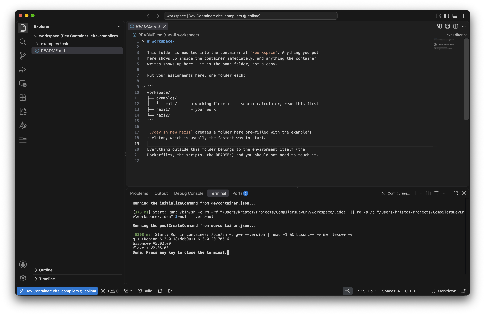

# Gyors kezdés

*[English version](quick_start.md) · [Teljes README](README.hu.md)*

Telepítsd a Dockert, aztán futtass egy parancsot. Minden más — a fordító, a
`bisonc++`, a `flexc++` — a konténerben van.

> **A Dockerhez kell a `buildx` komponens.** A Docker Desktop tartalmazza. Ha a
> sima Docker CLI-t telepíted, telepítsd a `docker-buildx` csomagot is: az
> IDE-k a `docker buildx build` paranccsal építik a dev containereket.

## macOS

**Docker Desktop** — a legegyszerűbb, a buildxet is tartalmazza:

```bash
brew install --cask docker
```

**vagy Colima** — könnyebb, nincs grafikus felülete, de a buildx külön csomag:

```bash
brew install colima docker docker-buildx
mkdir -p ~/.docker/cli-plugins
ln -sfn "$(brew --prefix)/lib/docker/cli-plugins/docker-buildx" ~/.docker/cli-plugins/docker-buildx
colima start --cpu 8 --memory 16 --vm-type vz --vz-rosetta
```

Apple Silicon gépen a `--vz-rosetta` tartja gyorsan a fordítást — az eszközlánc
x86-os, e nélkül a QEMU emulálná.

## Linux

**Debian / Ubuntu**

```bash
sudo apt update
sudo apt install -y docker.io docker-buildx
sudo usermod -aG docker "$USER"   # utána jelentkezz ki és be
```

**Fedora**

```bash
sudo dnf install -y docker docker-buildx
sudo systemctl enable --now docker
sudo usermod -aG docker "$USER"   # utána jelentkezz ki és be
```

**Arch**

```bash
sudo pacman -S --needed docker docker-buildx
sudo systemctl enable --now docker
sudo usermod -aG docker "$USER"   # utána jelentkezz ki és be
```

## Windows

```powershell
winget install Docker.DockerDesktop
```

A WSL 2 backendet kapcsold be, amikor a telepítő felajánlja. A buildx benne van.

## Ellenőrzés

```bash
git clone <ez-a-repo> && cd CompilersDevEnv
./dev.sh doctor     # Windowson: .\dev.ps1 doctor
./dev.sh test
```

A `test` végén `example: OK` kell álljon. Az első futás felépíti az image-et,
ez pár percig tart; utána minden indítás nagyjából egy másodperc.

## Használat IDE-ből

A repó tartalmaz `.devcontainer/devcontainer.json` fájlt, így mindkét IDE
beállítás nélkül felismeri. **Ha nincs kialakult kedvenced, használd a VS
Code-ot** — erre lett kifejlesztve és tesztelve ez a környezet, és gyorsabban
is indul.

### VS Code (javasolt)

1. Telepítsd a **Dev Containers** bővítményt (Extensions panel,
   <kbd>Ctrl/Cmd+Shift+X</kbd>, keresd meg: "Dev Containers").
2. **File → Open Folder…**, és válaszd ki a `CompilersDevEnv` mappát.
3. Jobbra lent megjelenik egy felugró ablak: *"Folder contains a Dev
   Container configuration file. Reopen folder to develop in a container?"*
   — kattints a **Reopen in Container** gombra.
   - Nem jött fel a felugró ablak? Nyomj <kbd>F1</kbd>-et, és futtasd magad a
     **Dev Containers: Reopen in Container** parancsot.
4. Csak első alkalommal épül fel az image (néhány perc, a folyamat egy
   naplópanelen látszik). Utána már csak néhány másodperc.
5. Akkor kész, ha az ablak címsora ezt írja: `[Dev Container:
   elte-compilers]`, és a beépített terminál (<kbd>Ctrl/Cmd+`</kbd>) a
   konténeren belül fut.



### CLion (és más JetBrains IDE-k)

1. Nyisd meg a projekt mappáját.
2. Nyisd meg a `.devcontainer/devcontainer.json` fájlt — rejtett mappában van,
   ezért a Project nézetet használd, ne a Findert vagy az Intézőt.
3. Kattints a konténer ikonra a nyitó `{` melletti margón.
4. Válaszd a **Create Dev Container and Mount Sources** lehetőséget.
5. Backendnek válaszd a **CLion**-t.

A CLion a `workspace/` mappát nyitja meg, és a `workspace/examples/calc/`
mappában van `CMakeLists.txt`, így a példa CMake projektként töltődik be,
működő kódkiegészítéssel és debuggolással.

### IDE nélkül

Tarts nyitva egy shellt, és használd a `make`-et:

```bash
./dev.sh          # shell a konténerben, a workspace/ mappádban
make              # fordítsd, amin éppen dolgozol
```

## Mindennapok

```bash
./dev.sh new hazi1    # új feladat a példa vázából
./dev.sh              # shell
./dev.sh verify       # beadás előtt: fordítás igazi 32 bites Debian 9-en
```

A kódod a `workspace/` mappába kerül, ami a konténeren belül és kívül ugyanaz a
mappa. Minden egyéb a [teljes READMEben](README.hu.md) van.
